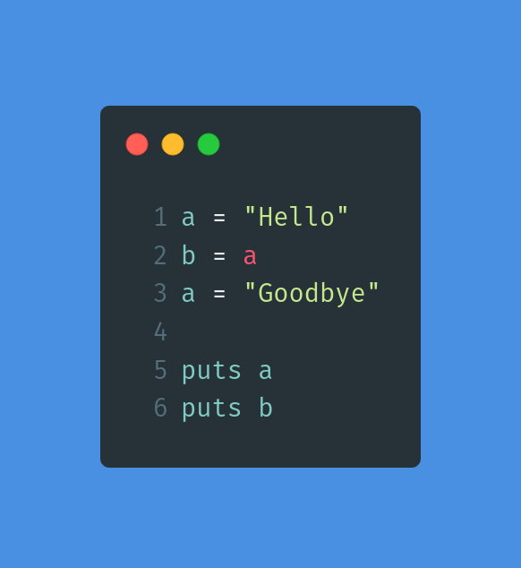

After over 300.5 hours in RB101, I feel both excited and scared of the written assessment prep. Nevertheless, I have and will take small steps everyday because I've learned through experience that I can go a lot further than I expect when I put in a little work everyday. Today, I had an enlightening and encouraging experience reading about another student's experience with written assessment prep.

Take this example: "What does the following code return? What does it output? Why? What concept does it demonstrate?"

A student's answer was thorough, but I noticed minor mistakes. Here's the relevant portion of her answer:

> ...On line 2, local variable `b` is initialized as being equal to `a`...

I might be wrong, but I think that it's not that `b` is initialized as being equal to `a`. Instead, we initialize `b` to same string that `a` points to,`"Hello"`. Being able to point out the mistake in her answer (despite her passing the written assessment prep) helps me feel more confident that I too can pass the written assessment prep.

Furthermore, the student wraps `string` and `class` in \`'s, which seems to conflict with how Launch School examples mark up code portions of the example explanations.

Here's my example, which you can feel free to pick apart too. May it help you improve your own confidence too!

### My Attempt
The code returns `nil` because the last expression evaluated is `puts b`,which returns `nil`. We initialize both local variables `a` and `b` to the string `"Hello"` and then reassign `a` to the string `"Goodbye"`.Thus, when we invoke `puts` on line 4 and pass in `a` as an argument, `a` is pointing to the string `"Goodbye"`, so that is what we output. When we invoke `puts` and pass in `b` on line 5, `b` points to `"Hello"`, so we output that string. This example demonstrates the concept of variables as pointers. Variables point to objects and we can make the variables point to different objects without affecting other variables.

### Conclusion

- There's more wiggle room than I expected for written assessment answers.
- You don't have to have great grammar, just good enough grammar to communicate that you understand the problem and concepts associated with the problem.
- Memorization will be helpful.

**Action Steps**:
- Memorize words/terms and definitions of:
  - initialized
  - defined
  - assigned
  - reference
  - passed in as argument
  - method invocation along with do..end defines a block
  - method definition,
  - input parameter
  - outer scope
  - inner scope
  - mutate
  - destructive method
  - reassigned

- Start practicing: https://docs.google.com/document/d/16XteFXEm3lFbcavrXDZs45rNEc1iBxSYC8e4pLhT0Rw/edit

