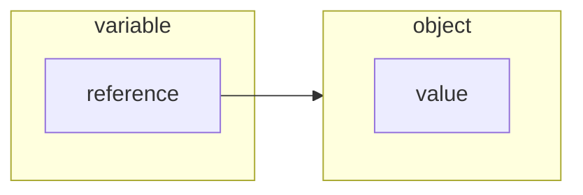
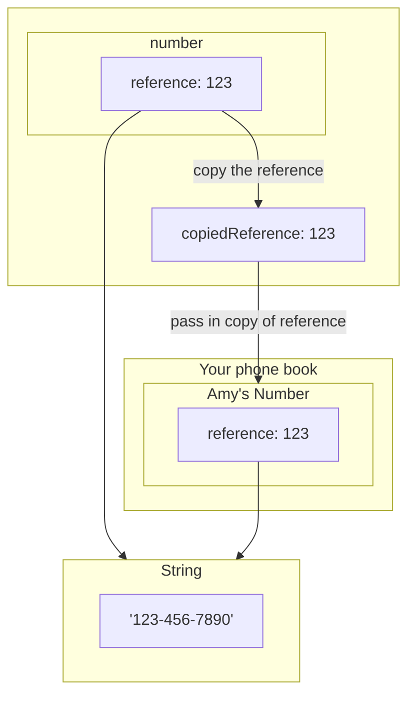

# Part 3: [Object Passing in Ruby — Pass by Reference or Pass by Value](https://launchschool.medium.com/object-passing-in-ruby-pass-by-reference-or-pass-by-value-6886e8cdc34a)

## Review

- How does ruby use variables to reference objects?
  - Variables store object ids, which are pointers to where objects are in memory. When
- What is mutability and immutability?
- What does it mean for a method to be mutating or non-mutating?
- What object passing strategy does ruby _appear_ to use for immutable objects? For mutable objects?
- What's the difference between assignment and setter and indexed assignment methods?

## What is Object Passing?

Object passing is how we make an object available within a method.

What objects are part of object passing?
1. _caller_, the object we invoke a method on... an implied argument
2. return values
3. arguments we pass into a method

Object passing applies to:
- methods (and some operators which also count as methods)
- blocks
- procs
- lambdas

## What are Evaluation Strategies?

An **evaluation strategy** is _when_ we reduce expressions into objects. **Strict** evaluation strategies convert expressions into objects _before_ passing in thesse objects into methods. Ruby uses strict evaluation.

Pass by value and pass by reference are some examples of strict evaluation strategies.

## Why is the Object Passing Strategy Important?

Understanding the strategy used to pass in an object allows you to understand what the method does to the object.


What would this code output if the code was using pass by value? Pass by reference?
```ruby
def increment(x)
  x << 'b'
end

y = 'a'
increment(y)
puts y
```

If the code uses pass-by-value, then we'd make a copy of the string referenced by `y` and mutate that copy. Therefore, `puts y` would output `a`.

If the code uses pass-by-reference, then we'd mutate the string referenced by `y` to be `ab`, so the code outputs that string.

## Pass by Value

1. Copy the object
2. Pass in the copy

Any changes we make to the copy don't reflect in the original object.

```ruby
def plus(x, y)
  x = x + y
end

a = 3
b = plus(a, 2)
puts a # 3
puts b # 5
```

We don't mutate the Integer referenced by `a`. Instead, we initialize `b` to a new Integer, hence why  Ruby _appears_ to be pass by value when passing immutable objects.

## Pass by Reference

Make a pointer to the original object available in the method. The argument and the original object refer to the same spot in memory. Thus, when you change that the argument, you change the original object.

What happens in this example?
```ruby
def uppercase(value)
  value.upcase!
end

name = 'William'
uppercase(name)
puts name         # WILLIAM
```

> Ruby appears to use pass by reference when passing multiple objects.

Since we mutated the `name` String when we invoked `uppercase`, `value` and `name` must have referenced the same object in memory.

## It's References All The Way Down

When we pass in an immutable object to a method and initialize an argument to that object, the object id remains the same. Therefore, we did not make a copy of the object. Since pass by value strategy requires we make a copy of the object and pass in that copy, Ruby cannot be pass by value.

```ruby
def hi(name)
  puts name.object_id
end

my_name = "Richard"
puts "Outside method, #{my_name.object_id}"
hi(my_name)
```

The code will print the same object id in both invocations of `puts`. Therefore, both `name` and `my_name` point to the same string, `Richard`.

In Ruby, pass-by-reference means an object is mutable _if_ the object has methods that can its value. However, pass-by-reference can be used with non-mutable objects too.

## Pass By Reference Value

In pure pass-by-reference, assignment is mutating. But in Ruby, assignment is _non_-mutating because variables contain _references_ not objects.

Assignment changes the reference stored in variables, not the objects pointed to by the variables.

> While we can change which object is bound to a variable inside of a method, we can’t change the binding of the original arguments. We can change the objects if the objects are mutable, but the references themselves are immutable as far as the method is concerned.

Ruby makes copies of references and passes in those copies to methods. We cannot mutate references.

> The original reference given by the argument cannot be reassigned.


### Analogy

A reference is like a cell phone number. With this number, I can call a friend. To make it easier to call my friends, I store my friends' numbers in my contacts. For instance, I might create a contact for my friend "Amy" and store `123-456-7890` as her number in the entry. Now, I can call Amy anytime I want.

The entry in my phonebook for Amy is like a variable, which contains a reference (the phone number).

However, you can't call her unless you have her number, so we make a new entry for Amy and store her number in that entry. Now, you can call Amy from your contacts.

Your ability to call Amy from your contacts is like a method. Unless we initialize an entry in your phone book, you don't have access to Amy. When I give you her number, I am passing a reference to Amy into your calling method. Now, you too can call Amy.

However, if you change Amy's phone number in your phone. You don't have access to the same Amy as I do, you have access to a different Amy. That being said, my phone's entry for Amy is still pointing to the same Amy as before, since you changing the number stored in your phone doesn't affect the number stored in my phone.

### Visual Example

Abstraction:


In this example below, the variable `number` stores a reference to the String `"123-456-7890"`. We pass in a _copy_ of the `reference` to a String and store that reference for `Amy's Number`. Both `Amy's Number` and the `number` point to the same String.



Reassigning `Amy's Number` to a different string does _not_ change the original reference number stored in `number`. Thus, `Amy's Number` points to a different String, `999-999-9999`, while `number` still points to `123-456-7890`.

[](https://mermaid.live/edit#pako:eNptkstqwzAQRX9l0CabGNr0KS8KLe2uZJF0V5WiWONYYElBj4YQ598rW0oa0xiMZ6R77xwG70llBJKS1K3ZVg23Hj5emAZwYbW2fNOAQt8Y8cmIMwpzx8hXrwEQ0mLlpdHwvkgnJ19tJWrxrYNaoY32Z7WbOJgP7cnfPxsjtR8kFmu0qCss4Xp2MxIVxRN0Frlzcq0hZaXoDjRuF0fnOIXSWUyBFBNp-iJ_zk0pfeBw4E0HS2-lXs-YHm0in8YRc9zm7gT5w9uA_R2ltMgvzbd55CgswSevvUz_t4MhoC_sCDkj_DvPG70Af8YaZ03ihOL27r54eKRXk_NZZEoUWsWliL_GfoAnvkGFjJSxFFjz0HpGmD5EadgI7vFNSG8sKWveOpwSHrxZ7nRFSm8DHkWvkkcelVWHX5TW00o)


## Final Mental Model

1. Ruby is **pass by reference value**.
2. Ruby is pass by reference, assuming

> you account for assignment and immutability

3. Ruby appears to _act_ like pass by value for immutable objects and pass by reference for mutable objects.
